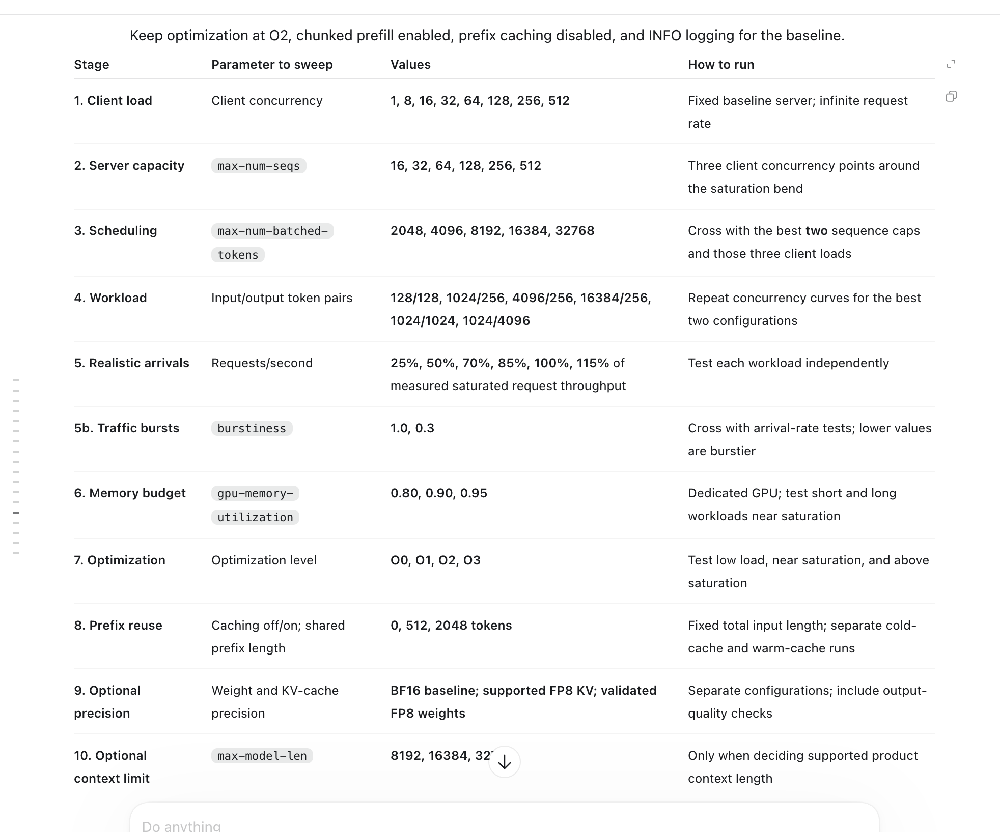
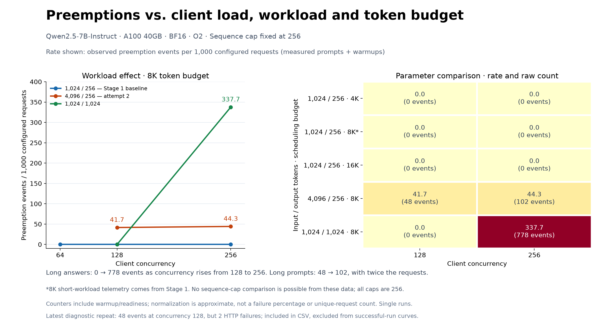

## A100 40GB benchmark findings — September 3, 2026

Model: `Qwen/Qwen2.5-7B-Instruct`. Serving baseline: BF16, optimization level O2, chunked prefill enabled, prefix caching disabled, and a fixed workload of 1,024 input tokens / 256 output tokens.

| Stage | Findings | Recorded execution time |
| --- | --- | --- |
| **1. Client concurrency** | Swept concurrency from 1 to 512. Throughput flattened around 128–256 concurrent requests; increasing to 512 did not help. | **0.48 hours (29 minutes)** |
| **2. Server sequence capacity** | A full standalone Stage 2 sweep was not completed. Stage 3 compared `max_num_seqs=128` and `256`: throughput was nearly equal at lower client concurrency, while cap 256 delivered about 6.9% more throughput at client concurrency 256 with the 8K token budget. These are candidate caps, not confirmed winners from a full capacity sweep. | Included in Stage 3; no separate time allocation. |
| **3. Scheduling token budget** | Collected 10 combinations across sequence caps, client concurrency, and token budgets. At sequence cap 256, a 16K budget produced 1.9% more output throughput than 8K at concurrency 128 and 4.9% more at concurrency 256. However, p99 inter-token latency increased from roughly 501–548 ms to 943–993 ms. Keep 8K as the baseline pending repeat measurements; 16K is not established as the best user experience. | **At least 0.57 hours (34 minutes)** |

### Human Commnent: 
There isn't much variation in the 3 parameters, client_concurrency(client load), max_num_sequences (server), max_num_batched_tokens. vllm was probably desgined to be stable and not fail at higher loads. 

### Time accounting and limits

- **Total documented execution time: at least 1.05 hours (63 minutes).** This includes available startup/warmup overhead and the failed Stage 3 attempt. Startup time for the supplemental 128-sequence-cap run is missing; only its client wall time is available.
- The elapsed timestamp span from the start of Stage 1 through the final Stage 3 run was **2 hours 16 minutes**, including gaps. This is not a measurement of hands-on work or billed GPU hours.
- Earlier setup, scripting, analysis, and offline experiments are outside these execution totals.
- Results are single runs per combination. Repeat promising configurations before treating small differences as reliable. The 4K and 16K budgets were tested only at sequence cap 256 and client concurrency 128/256.

### Saved results

- Stage 1: `colab/a100_40GB_concurrency_client/a100_concurrency_sweep/`
- Stage 3, 8K budget / sequence cap 256: `colab/a100_stage3/summary.json`
- Stage 3, 8K budget / sequence cap 128: `colab/a100_stage3/a100_stage3_128/`
- Stage 3, 4K budget: `colab/a100_stage3/token_budget_4k/a100_stage3_tokens4096/`
- Stage 3, 16K budget: `colab/a100_stage3/token_budget_16k/a100_stage3_tokens16384/`

## Preemptions versus load and scheduling parameters

