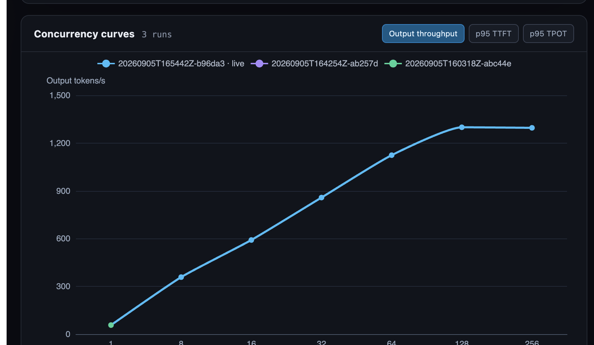

# vLLM benchmark dashboard

The React app runs on macOS. A private FastAPI process runs on the Runpod and launches `/workspace/concurrency_sweep.py`. An SSH tunnel maps the remote API to `http://127.0.0.1:8787`; Vite proxies `/api` requests to that address.

Install Node.js, npm, Python 3, and an SSH client on the MacBook. Copy the example once, then edit `.env.local` whenever the pod address, SSH port, paths, model, or benchmark defaults change:

```bash
cd /Users/dc/llm_benchmarking/dashboard
cp .env.example .env.local
```

The checked-in example documents every setting. `.env.local` is ignored by Git.

For a new Runpod GPU pod, enter its SSH host and port in `.env.local`, then run this from the MacBook:

```bash
cd /Users/dc/llm_benchmarking/dashboard
./scripts/bootstrap-new-runpod.sh
```

The bootstrap verifies the NVIDIA GPU, creates `/opt/vllm-venv` with managed Python 3.11, installs the pinned vLLM version and controller dependencies, copies the controller and sweep script, creates `/workspace/past_runs`, and starts the private API. Model weights download into `/workspace/huggingface` on the first benchmark run.

Open two macOS terminals:

```bash
cd /Users/dc/llm_benchmarking/dashboard
./scripts/open-runpod-tunnel.sh
```

```bash
cd /Users/dc/llm_benchmarking/dashboard
npm ci
npm run dev
```

Open http://127.0.0.1:5173. Use **Run smoke test** for a one-request validation or **Run full sweep** for the complete 1–512 concurrency run.

To update or restart the private Runpod API when the vLLM environment already exists:

```bash
cd /Users/dc/llm_benchmarking/dashboard
./scripts/deploy-runpod-server.sh
```

The Runpod API binds only to `127.0.0.1:8787`. Its stdout is stored in `/workspace/benchmark_server.log`; each sweep writes its combined live output to `/workspace/output.txt` and keeps all run directories and ZIP archives under `/workspace/past_runs`.

Every run directory contains `system_config.json`, a structured record of the GPU and baseline GPU memory, CPU, host memory, disk space, Python and vLLM package versions, environment settings, and exact launcher, server, and benchmark commands. The larger `manifest.json` keeps the run lifecycle and detailed diagnostics.

## Live concurrency graph


